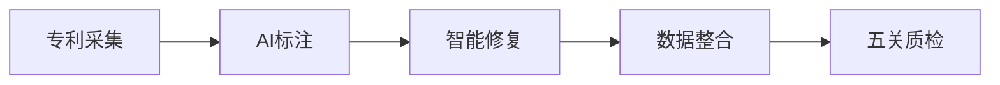

# 李梁个人简历网站设计方案

**日期**: 2026-06-25
**目标**: 构建简约科技风的个人简历展示网站，支持招聘方直接访问与个人品牌长期建设
**部署方式**: GitHub Pages（零成本、自动部署）

---

## 一、项目概述

### 1.1 设计目标

- **招聘友好**: 提供比 PDF 更丰富的交互体验，突出数据工程 + AI 工程双能力
- **品牌建设**: SEO 优化，支持社交分享，长期维护
- **简约科技感**: 深色主题 + 渐变 + 流畅动效，符合数据工程师气质
- **内容为主**: 项目详情用 Markdown 管理，支持代码高亮、图表嵌入

### 1.2 技术选型

| 类别 | 技术栈 | 理由 |
|------|--------|------|
| 框架 | Next.js 14 (App Router) | 静态导出完美支持 GitHub Pages，SEO 友好，生态成熟 |
| 语言 | TypeScript | 类型安全，提升代码质量 |
| 样式 | Tailwind CSS 3.4 | 快速实现深色主题，原子化 CSS，开发效率高 |
| 动画 | Framer Motion 11 | 声明式动画，滚动触发、3D 变换支持优秀 |
| 内容 | MDX | Markdown + React 组件，项目详情既可写文本又可嵌入交互图表 |
| 图表 | Recharts | React 原生图表库，轻量级，支持技能雷达图 |
| 图标 | Lucide React | 现代、轻量、一致性好 |
| 部署 | GitHub Pages + Actions | 零成本，自动化部署，推送即上线 |

### 1.3 核心特性

- ✅ 响应式设计（移动端优先）
- ✅ 深色主题 + 渐变科技感
- ✅ 项目卡片 3D 悬停效果
- ✅ 技能雷达图可视化
- ✅ 工作经历时间轴
- ✅ MDX 项目详情页（支持代码高亮、流程图）
- ✅ 页面过渡动画
- ✅ SEO 优化 + 结构化数据
- ✅ Lighthouse 性能评分 95+
- ✅ WCAG 2.1 AA 可访问性

---

## 二、架构设计

### 2.1 项目结构

```
portfolio/
├── src/
│   ├── app/                          # Next.js App Router
│   │   ├── layout.tsx                # 根布局（字体、主题、全局导航）
│   │   ├── page.tsx                  # 首页（Hero + 项目列表 + 技能 + 经历）
│   │   ├── about/                    # 关于页（教育背景、技能详情）
│   │   │   └── page.tsx
│   │   ├── projects/                 # 项目列表页
│   │   │   ├── page.tsx
│   │   │   └── [slug]/               # 动态路由：项目详情页
│   │   │       └── page.tsx
│   │   ├── contact/                  # 联系页
│   │   │   └── page.tsx
│   │   └── not-found.tsx             # 自定义 404 页面
│   ├── components/
│   │   ├── Hero.tsx                  # 首屏 Hero 区（大字标题 + 动态标签）
│   │   ├── Navigation.tsx            # 顶部导航栏（固定、滚动后模糊）
│   │   ├── ProjectCard.tsx           # 项目卡片（3D 悬停 + 点击跳转）
│   │   ├── SkillRadar.tsx            # 技能雷达图（Recharts）
│   │   ├── Timeline.tsx              # 工作经历时间轴
│   │   ├── Footer.tsx                # 页脚（联系方式、社交链接）
│   │   ├── MDXComponents.tsx         # MDX 自定义组件（代码块、数据卡片）
│   │   └── ui/                       # 可复用 UI 组件
│   │       ├── Button.tsx
│   │       ├── Card.tsx
│   │       ├── Badge.tsx
│   │       └── DataCard.tsx          # 数据展示卡片（带趋势指示器）
│   ├── content/                      # 内容数据
│   │   ├── projects/                 # 项目 MDX 文件
│   │   │   ├── sirna-data-engineering.mdx
│   │   │   ├── hezhao-datawarehouse.mdx
│   │   │   └── hengqin-insurance.mdx
│   │   ├── experience.ts             # 工作经历数据
│   │   ├── skills.ts                 # 技能数据（分类 + 雷达图数据）
│   │   └── personal.ts               # 个人信息（教育背景、联系方式）
│   ├── lib/
│   │   ├── constants.ts              # 常量配置（导航、社交链接）
│   │   ├── utils.ts                  # 工具函数（日期格式化、类名合并）
│   │   └── mdx.ts                    # MDX 加载器（读取项目文件）
│   └── styles/
│       └── globals.css               # 全局样式（Tailwind 导入 + CSS 变量）
├── public/
│   ├── images/                       # 项目截图、架构图
│   │   ├── sirna-architecture.svg
│   │   ├── hezhao-dashboard.png
│   │   └── hengqin-pipeline.png
│   ├── resume/
│   │   └── 李梁_数据工程师.pdf       # PDF 简历
│   ├── og-image.png                  # Open Graph 图片（社交分享）
│   └── favicon.ico
├── .github/
│   └── workflows/
│       └── deploy.yml                # GitHub Actions 自动部署
├── tailwind.config.ts                # Tailwind 配置（主题、颜色、字体）
├── next.config.js                    # Next.js 配置（静态导出、basePath）
├── tsconfig.json                     # TypeScript 配置
├── package.json                      # 依赖管理
└── README.md                         # 项目文档
```

### 2.2 路由设计

| 路径 | 页面 | 描述 |
|------|------|------|
| `/` | 首页 | Hero + 核心优势 + 精选项目 + 技能雷达图 + 工作经历 |
| `/about` | 关于 | 教育背景、技能详情、个人陈述 |
| `/projects` | 项目列表 | 全部项目卡片（可按技术栈筛选） |
| `/projects/[slug]` | 项目详情 | MDX 渲染的项目完整介绍（背景、架构、成果） |
| `/contact` | 联系 | 联系方式、期望职位、简历下载 |

### 2.3 数据流

```
内容源（MDX/TS）
    ↓
lib/mdx.ts 加载器
    ↓
编译时静态生成（SSG）
    ↓
HTML 静态文件
    ↓
GitHub Pages 托管
```

---

## 三、页面设计详解

### 3.1 首页（/）

#### 布局结构

```
┌─────────────────────────────────────────┐
│  顶部导航（固定，滚动后背景模糊）         │
├─────────────────────────────────────────┤
│  Hero 区（全屏 100vh）                   │
│  ┌───────────────────────────────────┐  │
│  │  李梁                             │  │
│  │  [动态标签循环播放]                │  │
│  │  数据工程师 → AI数据工程 → 数仓建设 │  │
│  │                                   │  │
│  │  [查看项目] [下载简历]             │  │
│  └───────────────────────────────────┘  │
│  背景：深色渐变 + 粒子动效               │
├─────────────────────────────────────────┤
│  核心优势（4 宫格卡片，悬停放大）        │
│  ┌────────┐ ┌────────┐                 │
│  │ AI工程 │ │ 质量论 │                 │
│  └────────┘ └────────┘                 │
│  ┌────────┐ ┌────────┐                 │
│  │ 数仓0→1│ │ 结果导向│                 │
│  └────────┘ └────────┘                 │
├─────────────────────────────────────────┤
│  精选项目（3 卡片，3D 悬停）             │
│  [siRNA] [和兆] [横琴]                  │
│  点击跳转详情页                         │
├─────────────────────────────────────────┤
│  技能可视化                             │
│  ┌─────────────────┐ ┌───────────────┐ │
│  │  雷达图（6维）   │ │ 技术标签云    │ │
│  └─────────────────┘ └───────────────┘ │
├─────────────────────────────────────────┤
│  工作经历时间轴（竖向）                  │
│  ●─────  汉克时代（2024.03-至今）       │
│  │       - 关键成果1                    │
│  │       - 关键成果2                    │
│  ●─────  数字马力（2023.03-2024.01）    │
│          - 关键成果1                    │
├─────────────────────────────────────────┤
│  页脚（联系方式、GitHub、备案信息）      │
└─────────────────────────────────────────┘
```

#### 交互设计

**Hero 区**
- 标题渐入动画：淡入 + 上滑（Framer Motion）
- 动态标签：打字机效果，循环播放 3 个身份标签（react-type-animation）
- CTA 按钮：悬停渐变边框 + 发光效果
- 背景粒子：Canvas 绘制（可选，轻量级）

**核心优势卡片**
- 滚动触发：进入视口时逐个淡入（stagger 延迟 100ms）
- 悬停：卡片放大 1.05x + 阴影加深

**项目卡片**
- 默认状态：深色背景、渐变边框、技术标签
- 悬停状态：
  - 3D 倾斜（`transform: perspective(1000px) rotateX(5deg) rotateY(-5deg)`）
  - 内容上浮（`translateY(-8px)`）
  - 渐变边框高亮动画
- 点击：页面过渡动画（当前页淡出 → 详情页淡入）

**技能雷达图**
- 滚动触发：数据从 0 动画至目标值（duration: 1.5s，easing: easeInOut）
- 悬停维度：高亮该维度，显示技术栈详情 tooltip

**时间轴**
- 滚动触发：卡片依次淡入（stagger 200ms）
- 时间点脉冲动画（伪元素 scale 动画）

#### 响应式适配

| 屏幕 | Hero 标题 | 项目卡片布局 | 雷达图 |
|------|-----------|--------------|--------|
| 桌面 (>1280px) | 3.5rem | 3 列网格 | 完整显示 |
| 平板 (768-1280px) | 2.5rem | 2 列网格 | 缩小 80% |
| 移动 (<768px) | 2rem | 1 列堆叠 | 改为条形图 |

---

### 3.2 项目详情页（/projects/[slug]）

#### 布局结构

```
┌─────────────────────────────────────────┐
│  顶部导航                                │
├─────────────────────────────────────────┤
│  项目头部（渐变背景 + 项目代表色）       │
│  ┌───────────────────────────────────┐  │
│  │  siRNA 医药大模型数据工程体系     │  │
│  │  [AI工程] [LLM] [生物信息] [质检] │  │
│  └───────────────────────────────────┘  │
├─────────────────────────────────────────┤
│  内容区（MDX 渲染，最大宽度 800px）      │
│                                         │
│  ## 项目背景                            │
│  上智院世界科学智能大赛...               │
│                                         │
│  ## 技术架构                            │
│  [Mermaid 流程图]                       │
│                                         │
│  ## 核心贡献                            │
│  - 采集 + 筛选                          │
│    [数据卡片: 20万篇 → 2500篇]          │
│  - AI 标注                              │
│    [数据卡片: 4-6h → 15-30min]          │
│  - 智能修复（核心亮点）                 │
│    [代码块 + 语法高亮]                  │
│    [错误类型分布图表]                   │
│                                         │
│  ## 技术沉淀                            │
│  - 方法论：错误图谱 + 三段式策略...      │
│                                         │
│  ## 项目成果                            │
│  [4 宫格数据卡片]                       │
│  [数据处理效率] [质量提升] [人力节省]   │
├─────────────────────────────────────────┤
│  底部导航                               │
│  ← 上一个项目    下一个项目 →           │
└─────────────────────────────────────────┘
```

#### MDX 自定义组件

**DataCard（数据卡片）**
```tsx
<DataCard
  title="数据处理效率"
  before="4-6 小时/篇"
  after="15-30 分钟/篇"
  trend="down"  // 箭头方向（down = 性能提升）
  improvement="80%"
/>
```

**CodeBlock（代码块）**
- Prism.js 语法高亮
- 顶部显示语言标签
- 右上角复制按钮

**ArchitectureDiagram（架构图）**
```tsx
<ArchitectureDiagram>

</ArchitectureDiagram>
```

**MetricGrid（指标网格）**
```tsx
<MetricGrid
  metrics={[
    { label: '专利处理', value: '20万+ → 2500篇' },
    { label: '数据产出', value: '10万条' },
    { label: '质量提升', value: '60% → 90%+' },
    { label: '效率提升', value: '标注人力 -60%' }
  ]}
/>
```

#### 交互设计

- **滚动进度条**：顶部固定，显示阅读进度（`position: fixed; width: X%`）
- **代码块复制**：点击复制按钮，显示"已复制"提示（2s 后消失）
- **图片点击放大**：灯箱效果（next-image-zoom）
- **锚点导航**：右侧悬浮目录，点击平滑滚动到对应章节

---

### 3.3 关于页（/about）

#### 内容分区

1. **教育背景**
   - 学校、专业、GPA、奖项（标签展示）
   - 毕业论文：省级优秀

2. **技能详情**（分类卡片）
   - 编程语言：Python、SQL、Java、Shell
   - 数据仓库：Doris、Hive、Spark、StarRocks
   - AI 工程：LLM Prompt、BioPython、Scrapy
   - 工程化：Docker、K8s、Git、DolphinScheduler
   - BI 可视化：FineBI、FineReport、QuickBI

3. **核心优势深度解读**
   - 每项优势配图标 + 200 字描述 + 案例引用链接

4. **个人陈述**
   - 职业目标、技术热情、学习态度

---

### 3.4 联系页（/contact）

#### 布局

```
┌──────────────────────────────────┐
│  联系方式                        │
│  ┌────────────┐  ┌────────────┐ │
│  │ 左侧       │  │ 右侧       │ │
│  │            │  │            │ │
│  │ 📧 邮箱    │  │ 期望职位   │ │
│  │ 📱 电话    │  │ 到岗时间   │ │
│  │ 🔗 GitHub  │  │ 工作地点   │ │
│  │ 📍 位置    │  │            │ │
│  │            │  │            │ │
│  │ [二维码]   │  │ [下载PDF]  │ │
│  └────────────┘  └────────────┘ │
└──────────────────────────────────┘
```

#### 功能

- 邮箱/电话点击：自动打开邮件客户端 / 拨号
- GitHub 链接：新标签页打开
- 下载简历：点击下载 PDF（`/resume/李梁_数据工程师.pdf`）

---

## 四、设计系统

### 4.1 色彩方案

#### 主题变量（CSS Variables）

```css
:root {
  /* 背景层级 */
  --bg-primary: #0a0a0a;          /* 主背景（最深） */
  --bg-secondary: #141414;        /* 卡片背景 */
  --bg-tertiary: #1f1f1f;         /* 悬停状态 */

  /* 文本 */
  --fg-primary: #ffffff;          /* 主标题、重要文本 */
  --fg-secondary: #a3a3a3;        /* 正文 */
  --fg-tertiary: #666666;         /* 次要信息（时间、标签） */

  /* 品牌色（渐变） */
  --brand-from: #3b82f6;          /* 科技蓝 */
  --brand-to: #06b6d4;            /* 数据青 */
  --brand-gradient: linear-gradient(135deg, var(--brand-from), var(--brand-to));

  /* 强调色 */
  --accent-success: #10b981;      /* 成果数据（绿） */
  --accent-warning: #f59e0b;      /* 警示（黄） */
  --accent-error: #ef4444;        /* 错误（红） */

  /* 边框 */
  --border-subtle: #262626;       /* 微妙边框 */
  --border-default: #404040;      /* 默认边框 */

  /* 阴影 */
  --shadow-sm: 0 2px 8px rgba(0, 0, 0, 0.3);
  --shadow-md: 0 4px 16px rgba(0, 0, 0, 0.4);
  --shadow-lg: 0 8px 32px rgba(0, 0, 0, 0.5);
  --shadow-glow: 0 0 20px rgba(59, 130, 246, 0.3);  /* 品牌色发光 */
}
```

#### 渐变应用场景

| 场景 | 渐变定义 | 用途 |
|------|----------|------|
| Hero 背景 | `radial-gradient(ellipse at top, #1a1a2e, #0a0a0a)` | 营造深邃科技感 |
| 项目卡片边框 | `linear-gradient(90deg, #3b82f6, #06b6d4)` | 品牌色高亮 |
| 按钮悬停 | `linear-gradient(135deg, #3b82f6, #8b5cf6)` | 增强交互反馈 |
| 页面头部背景 | `linear-gradient(180deg, #1a1a2e 0%, #0a0a0a 100%)` | 区域分隔 |

### 4.2 排版系统

#### 字体配置

```typescript
// app/layout.tsx
import { Inter } from 'next/font/google';

const inter = Inter({
  subsets: ['latin'],
  display: 'swap',
  variable: '--font-inter',
});

// 中文字体使用系统字体栈
const fontSans = [
  'Inter',
  '-apple-system',
  'BlinkMacSystemFont',
  'Segoe UI',
  'Noto Sans SC',
  'sans-serif'
].join(',');
```

#### 字号比例（基于 Tailwind）

| 类型 | Tailwind 类 | 大小 | 用途 |
|------|-------------|------|------|
| H1 | `text-5xl` | 3rem (48px) | 页面主标题 |
| H2 | `text-4xl` | 2.25rem (36px) | 章节标题 |
| H3 | `text-2xl` | 1.5rem (24px) | 子章节 |
| Body | `text-base` | 1rem (16px) | 正文 |
| Small | `text-sm` | 0.875rem (14px) | 标签、时间 |
| Tiny | `text-xs` | 0.75rem (12px) | 辅助信息 |

#### 行高与字重

- **标题行高**: 1.2（紧凑，增强视觉冲击）
- **正文行高**: 1.75（宽松，提升可读性）
- **字重**:
  - 标题: 700 (Bold)
  - 正文: 400 (Regular)
  - 强调: 600 (Semibold)

### 4.3 间距系统

基于 8px 网格（Tailwind 默认）

| Tailwind 类 | 大小 | 用途 |
|-------------|------|------|
| `space-1` | 4px | 微小间距（标签内边距） |
| `space-2` | 8px | 小间距（按钮内边距） |
| `space-4` | 16px | 默认间距（卡片内边距） |
| `space-6` | 24px | 中等间距（章节间距） |
| `space-8` | 32px | 大间距（区块间距） |
| `space-12` | 48px | 超大间距（页面区域分隔） |
| `space-16` | 64px | 巨大间距（首屏 Hero） |

### 4.4 组件样式规范

#### Button（按钮）

**变体**

1. **Primary（主按钮）**
   - 背景：品牌渐变
   - 文字：白色
   - 悬停：渐变旋转 + 发光阴影
   - 示例：`[查看项目]`

2. **Secondary（次按钮）**
   - 背景：透明
   - 边框：渐变（使用伪元素实现）
   - 悬停：背景渐变淡入
   - 示例：`[下载简历]`

3. **Ghost（幽灵按钮）**
   - 背景：透明
   - 文字：次要色
   - 悬停：背景微亮
   - 示例：导航链接

#### Card（卡片）

**默认样式**
```css
.card {
  background: var(--bg-secondary);
  border: 1px solid var(--border-subtle);
  border-radius: 12px;
  padding: 1.5rem;
  transition: all 0.3s ease;
}

.card:hover {
  border-color: var(--border-default);
  box-shadow: var(--shadow-md);
  transform: translateY(-4px);
}
```

#### Badge（标签）

**技术栈标签**
- 背景：半透明品牌色（`rgba(59, 130, 246, 0.1)`）
- 边框：品牌色（`1px solid rgba(59, 130, 246, 0.3)`）
- 文字：品牌色
- 圆角：`6px`
- 内边距：`4px 12px`

---

## 五、动画设计

### 5.1 页面过渡

**路由切换动画**（Framer Motion）

```typescript
// app/layout.tsx
<motion.div
  initial={{ opacity: 0, y: 20 }}
  animate={{ opacity: 1, y: 0 }}
  exit={{ opacity: 0, y: -20 }}
  transition={{ duration: 0.3 }}
>
  {children}
</motion.div>
```

### 5.2 滚动触发动画

**配置**
- 触发位置：元素顶部进入视口 80% 时
- 动画类型：淡入 + 上滑
- 延迟：多个元素时 stagger 100-200ms

**示例**（项目卡片列表）
```typescript
<motion.div
  variants={{
    hidden: { opacity: 0, y: 50 },
    visible: {
      opacity: 1,
      y: 0,
      transition: {
        staggerChildren: 0.1
      }
    }
  }}
  initial="hidden"
  whileInView="visible"
  viewport={{ once: true, amount: 0.3 }}
>
  {projects.map(project => (
    <motion.div variants={itemVariants} key={project.slug}>
      <ProjectCard {...project} />
    </motion.div>
  ))}
</motion.div>
```

### 5.3 交互动画

**项目卡片 3D 悬停**
```typescript
<motion.div
  whileHover={{
    scale: 1.02,
    rotateX: 5,
    rotateY: 5,
    transition: { duration: 0.3 }
  }}
  style={{ transformStyle: 'preserve-3d' }}
>
  {/* 卡片内容 */}
</motion.div>
```

**按钮悬停发光**
```css
.btn-primary:hover {
  box-shadow:
    0 0 20px rgba(59, 130, 246, 0.5),
    0 0 40px rgba(59, 130, 246, 0.3);
  transition: box-shadow 0.3s ease;
}
```

### 5.4 数据动画

**技能雷达图绘制**
- 数据从 0 动画至目标值
- 持续时间：1.5s
- 缓动函数：`easeInOut`
- 延迟：滚动触发后 200ms

**数字计数动画**（DataCard 组件）
```typescript
import { useCountUp } from 'react-countup';

<span ref={countUpRef} />  // 从 0 滚动至目标数字
```

---

## 六、性能优化

### 6.1 图片优化

**策略**
1. **Next.js Image 组件**：自动 WebP 转换、懒加载、响应式
2. **图片尺寸**：
   - 项目缩略图：800x450 (16:9)
   - 项目详情大图：1600x900 (16:9)
   - 头像：200x200
3. **响应式**：提供 @1x、@2x、@3x 三种尺寸
4. **SVG 优先**：图标、架构图使用 SVG
5. **背景图**：CSS 渐变替代位图

**示例**
```tsx
<Image
  src="/images/sirna-architecture.svg"
  alt="siRNA 数据工程架构图"
  width={1200}
  height={675}
  priority={false}  // 首屏外的图片设为 false
  placeholder="blur"
/>
```

### 6.2 代码分割

**策略**
1. **路由级分割**：Next.js App Router 自动实现
2. **组件级分割**：
   - 图表库（Recharts）按需动态导入
   - MDX 内容按路由动态加载

**示例**
```typescript
// components/SkillRadar.tsx
import dynamic from 'next/dynamic';

const RadarChart = dynamic(
  () => import('recharts').then(mod => mod.RadarChart),
  { ssr: false }  // 客户端渲染（图表不影响 SEO）
);
```

### 6.3 字体优化

**策略**
1. **自托管**：使用 `next/font` 自托管 Inter，避免外部请求
2. **子集加载**：仅加载 Latin 字符集
3. **字体交换策略**：`display: swap`（先显示系统字体，字体加载后替换）

### 6.4 构建优化

**Next.js 配置**
```javascript
// next.config.js
module.exports = {
  output: 'export',  // 静态导出
  images: {
    unoptimized: true,  // GitHub Pages 不支持动态图片优化
  },
  compress: true,  // Gzip 压缩
  swcMinify: true,  // SWC 压缩（比 Terser 快 7x）
};
```

**Tailwind 配置**
```javascript
// tailwind.config.ts
module.exports = {
  content: ['./src/**/*.{js,ts,jsx,tsx,mdx}'],
  theme: {
    extend: { /* 自定义主题 */ }
  },
  // JIT 模式默认开启，仅生成使用的样式
};
```

### 6.5 性能目标

| 指标 | 目标值 | 测量工具 |
|------|--------|----------|
| First Contentful Paint (FCP) | < 1.5s | Lighthouse |
| Largest Contentful Paint (LCP) | < 2.5s | Lighthouse |
| Time to Interactive (TTI) | < 3.5s | Lighthouse |
| Cumulative Layout Shift (CLS) | < 0.1 | Lighthouse |
| Performance Score | 95+ | Lighthouse |
| Total Bundle Size | < 500KB | Next.js build output |

---

## 七、SEO 优化

### 7.1 元标签配置

**全局元标签**（app/layout.tsx）
```typescript
export const metadata: Metadata = {
  title: {
    default: '李梁 - 数据开发工程师 | AI数据工程 & 数仓建设',
    template: '%s | 李梁'
  },
  description: '3年数据工程经验，擅长AI训练数据生产、离线数仓0→1建设、数据质量治理。覆盖 Doris/Hive 数仓建模与 LLM 信息抽取全链路。',
  keywords: [
    '数据工程师',
    'AI数据工程',
    '数据仓库',
    'Python开发',
    'siRNA',
    '大模型训练数据',
    '数据质量治理',
    'Doris',
    'Hive'
  ],
  authors: [{ name: '李梁' }],
  creator: '李梁',
  openGraph: {
    type: 'website',
    locale: 'zh_CN',
    url: 'https://yourusername.github.io/portfolio',
    title: '李梁 - 数据开发工程师',
    description: 'AI数据工程全链路 · 数仓0→1独立交付',
    images: [
      {
        url: '/og-image.png',
        width: 1200,
        height: 630,
        alt: '李梁个人简历'
      }
    ]
  },
  twitter: {
    card: 'summary_large_image',
    title: '李梁 - 数据开发工程师',
    description: 'AI数据工程 & 数仓建设专家',
    images: ['/og-image.png']
  }
};
```

**页面级元标签**（app/projects/[slug]/page.tsx）
```typescript
export async function generateMetadata({ params }): Promise<Metadata> {
  const project = await getProject(params.slug);
  return {
    title: project.title,
    description: project.summary,
    openGraph: {
      title: project.title,
      description: project.summary,
      images: [project.thumbnail]
    }
  };
}
```

### 7.2 结构化数据（JSON-LD）

**Person Schema**
```typescript
const personSchema = {
  "@context": "https://schema.org",
  "@type": "Person",
  "name": "李梁",
  "jobTitle": "数据开发工程师",
  "url": "https://yourusername.github.io/portfolio",
  "sameAs": [
    "https://github.com/yourusername"
  ],
  "knowsAbout": [
    "Data Engineering",
    "AI Data Pipeline",
    "Data Warehouse",
    "Python",
    "SQL"
  ],
  "alumniOf": {
    "@type": "EducationalOrganization",
    "name": "郑州轻工业大学"
  }
};
```

**WebSite Schema**
```typescript
const websiteSchema = {
  "@context": "https://schema.org",
  "@type": "WebSite",
  "name": "李梁 - 数据开发工程师",
  "url": "https://yourusername.github.io/portfolio",
  "potentialAction": {
    "@type": "SearchAction",
    "target": "https://yourusername.github.io/portfolio/projects?q={search_term_string}",
    "query-input": "required name=search_term_string"
  }
};
```

### 7.3 Sitemap 与 Robots

**Sitemap 自动生成**（app/sitemap.ts）
```typescript
import { MetadataRoute } from 'next';

export default function sitemap(): MetadataRoute.Sitemap {
  const baseUrl = 'https://yourusername.github.io/portfolio';
  const projects = getProjects();

  return [
    {
      url: baseUrl,
      lastModified: new Date(),
      changeFrequency: 'monthly',
      priority: 1,
    },
    {
      url: `${baseUrl}/about`,
      lastModified: new Date(),
      changeFrequency: 'monthly',
      priority: 0.8,
    },
    ...projects.map(p => ({
      url: `${baseUrl}/projects/${p.slug}`,
      lastModified: new Date(p.updatedAt),
      changeFrequency: 'yearly',
      priority: 0.7,
    })),
  ];
}
```

**Robots.txt**（public/robots.txt）
```
User-agent: *
Allow: /

Sitemap: https://yourusername.github.io/portfolio/sitemap.xml
```

---

## 八、可访问性（WCAG 2.1 AA）

### 8.1 语义化 HTML

**页面结构**
```html
<body>
  <header>
    <nav aria-label="主导航">...</nav>
  </header>

  <main>
    <section aria-labelledby="hero-title">
      <h1 id="hero-title">李梁</h1>
    </section>

    <section aria-labelledby="projects-title">
      <h2 id="projects-title">精选项目</h2>
      <article>...</article>
    </section>
  </main>

  <footer>...</footer>
</body>
```

### 8.2 键盘导航

**要求**
- 所有交互元素支持 Tab 键聚焦
- 焦点顺序符合视觉流
- 焦点可见样式清晰（focus-visible）

**焦点样式**
```css
*:focus-visible {
  outline: 2px solid var(--brand-from);
  outline-offset: 4px;
  border-radius: 4px;
}
```

### 8.3 ARIA 标签

**导航**
```tsx
<nav aria-label="主导航">
  <ul>
    <li><a href="/" aria-current="page">首页</a></li>
    <li><a href="/projects">项目</a></li>
  </ul>
</nav>
```

**按钮**
```tsx
<button aria-label="下载简历 PDF">
  <DownloadIcon />
  下载简历
</button>
```

**图表**
```tsx
<div role="img" aria-label="技能雷达图：Python 90%，SQL 95%，数据仓库 90%">
  <RadarChart />
</div>
```

### 8.4 颜色对比度

**检查清单**
- 白色文本 (#ffffff) on 深色背景 (#0a0a0a)：21:1 ✅
- 次要文本 (#a3a3a3) on 深色背景 (#0a0a0a)：10.5:1 ✅
- 品牌色文本 (#3b82f6) on 深色背景 (#0a0a0a)：8.2:1 ✅

**工具**：WebAIM Contrast Checker

---

## 九、部署方案

### 9.1 GitHub Pages 配置

**仓库设置**
1. 创建仓库：`yourusername/portfolio`
2. 仓库设置 → Pages → Source: `gh-pages` 分支
3. （可选）自定义域名：添加 `CNAME` 文件

**Next.js 配置**（next.config.js）
```javascript
const isProd = process.env.NODE_ENV === 'production';

module.exports = {
  output: 'export',
  basePath: isProd ? '/portfolio' : '',
  assetPrefix: isProd ? '/portfolio/' : '',
  images: {
    unoptimized: true,
  },
  trailingSlash: true,  // 确保路由兼容性
};
```

### 9.2 GitHub Actions 自动部署

**工作流配置**（.github/workflows/deploy.yml）
```yaml
name: Deploy to GitHub Pages

on:
  push:
    branches: [main]
  workflow_dispatch:

permissions:
  contents: read
  pages: write
  id-token: write

jobs:
  build:
    runs-on: ubuntu-latest
    steps:
      - name: Checkout
        uses: actions/checkout@v4

      - name: Setup Node.js
        uses: actions/setup-node@v4
        with:
          node-version: 18
          cache: 'npm'

      - name: Install dependencies
        run: npm ci

      - name: Build
        run: npm run build
        env:
          NODE_ENV: production

      - name: Upload artifact
        uses: actions/upload-pages-artifact@v3
        with:
          path: ./out

  deploy:
    environment:
      name: github-pages
      url: ${{ steps.deployment.outputs.page_url }}
    runs-on: ubuntu-latest
    needs: build
    steps:
      - name: Deploy to GitHub Pages
        id: deployment
        uses: actions/deploy-pages@v4
```

### 9.3 部署流程

1. **本地开发**
   ```bash
   npm run dev  # 启动开发服务器（http://localhost:3000）
   ```

2. **构建测试**
   ```bash
   npm run build  # 构建静态文件到 ./out
   npm run start  # 本地预览构建结果
   ```

3. **推送部署**
   ```bash
   git add .
   git commit -m "feat: add project detail pages"
   git push origin main  # 自动触发 GitHub Actions
   ```

4. **访问网站**
   - 默认 URL: `https://yourusername.github.io/portfolio`
   - 自定义域名: `https://lilian.dev`（需配置 DNS）

### 9.4 自定义域名配置

**步骤**
1. 在域名注册商添加 DNS 记录：
   ```
   Type: CNAME
   Name: @  (或 www)
   Value: yourusername.github.io
   ```

2. 仓库根目录添加 `public/CNAME` 文件：
   ```
   lilian.dev
   ```

3. GitHub 仓库设置 → Pages → Custom domain: `lilian.dev`

4. 等待 DNS 生效（最多 24 小时）

---

## 十、测试策略

### 10.1 单元测试

**工具**：Vitest + Testing Library

**覆盖范围**
- 工具函数（日期格式化、类名合并）
- 数据转换逻辑（MDX 元数据解析）

**示例**
```typescript
// lib/utils.test.ts
import { describe, test, expect } from 'vitest';
import { formatDuration, cn } from './utils';

describe('formatDuration', () => {
  test('计算工作时长（至今）', () => {
    expect(formatDuration('2024.03', '至今')).toMatch(/\d+ 年 \d+ 个月/);
  });

  test('计算工作时长（已离职）', () => {
    expect(formatDuration('2023.03', '2024.01')).toBe('10 个月');
  });
});

describe('cn（类名合并）', () => {
  test('合并多个类名', () => {
    expect(cn('text-base', 'font-bold')).toBe('text-base font-bold');
  });

  test('条件类名', () => {
    expect(cn('text-base', false && 'hidden')).toBe('text-base');
  });
});
```

### 10.2 端到端测试

**工具**：Playwright

**测试场景**
1. **首页导航流程**
   - 加载首页 → 点击项目卡片 → 查看详情页 → 返回首页

2. **下载简历**
   - 访问联系页 → 点击下载按钮 → 验证文件下载

3. **响应式测试**
   - 在桌面、平板、移动端视口测试布局

**示例**
```typescript
// tests/navigation.spec.ts
import { test, expect } from '@playwright/test';

test('首页导航到项目详情', async ({ page }) => {
  await page.goto('/');

  // 等待首屏加载
  await expect(page.getByRole('heading', { name: '李梁' })).toBeVisible();

  // 点击第一个项目卡片
  await page.getByRole('article').first().click();

  // 验证跳转到详情页
  await expect(page).toHaveURL(/\/projects\/.*$/);
  await expect(page.getByRole('heading', { level: 1 })).toBeVisible();
});
```

### 10.3 可访问性测试

**工具**：axe-core + Playwright

**检查项**
- ARIA 标签完整性
- 键盘导航可用性
- 颜色对比度
- 语义化 HTML

**示例**
```typescript
// tests/a11y.spec.ts
import { test, expect } from '@playwright/test';
import AxeBuilder from '@axe-core/playwright';

test('首页无可访问性问题', async ({ page }) => {
  await page.goto('/');
  const results = await new AxeBuilder({ page }).analyze();
  expect(results.violations).toEqual([]);
});
```

### 10.4 性能测试

**工具**：Lighthouse CI

**集成**（.github/workflows/lighthouse.yml）
```yaml
name: Lighthouse CI

on: [pull_request]

jobs:
  lighthouse:
    runs-on: ubuntu-latest
    steps:
      - uses: actions/checkout@v4
      - uses: actions/setup-node@v4
      - run: npm ci
      - run: npm run build
      - run: npx lighthouse-ci --upload.target=temporary-public-storage
      - name: 检查性能评分
        run: |
          score=$(jq -r '.categories.performance.score * 100' lhci_reports/*.json)
          if (( $(echo "$score < 90" | bc -l) )); then
            echo "性能评分 $score < 90，构建失败"
            exit 1
          fi
```

---

## 十一、内容数据结构

### 11.1 项目数据（MDX Frontmatter）

**示例**：content/projects/sirna-data-engineering.mdx

```mdx
---
title: "siRNA 医药大模型数据工程体系"
slug: "sirna-data-engineering"
company: "上海人工智能实验室"
duration: "2024.03 - 至今"
tags:
  - "AI数据工程"
  - "LLM"
  - "生物信息学"
  - "数据质检"
color: "#3b82f6"
thumbnail: "/images/sirna-thumbnail.png"
order: 1
summary: "独立设计并落地「AI 标注 → 智能修复 → 数据整合 → 数据质检」四阶段自动化流水线，将单篇专利处理从人工 4-6 小时压缩至分钟级，最终从 60 万+ 候选数据中质检产出约 10 万条模型可用数据。"
metrics:
  - label: "专利处理"
    value: "20万+ → 2500篇"
  - label: "数据产出"
    value: "10万条"
  - label: "质量提升"
    value: "60% → 90%+"
  - label: "效率提升"
    value: "4-6h → 15-30min"
---

## 项目背景

上智院世界科学智能大赛生命科学赛道核心项目。需从全球近十年约 20 万篇专利中...

（正文内容）
```

### 11.2 技能数据（TypeScript）

**content/skills.ts**
```typescript
export interface SkillCategory {
  name: string;
  items: string[];
}

export const skills: SkillCategory[] = [
  {
    name: '编程语言',
    items: ['Python', 'SQL', 'Java', 'Shell']
  },
  {
    name: '数据仓库',
    items: ['Doris', 'Hive', 'Spark', 'StarRocks']
  },
  {
    name: 'AI 工程',
    items: ['LLM Prompt Engineering', 'BioPython', 'Scrapy-Redis']
  },
  {
    name: '工程化',
    items: ['Docker', 'Kubernetes', 'Git', 'DolphinScheduler']
  },
  {
    name: 'BI 可视化',
    items: ['FineBI', 'FineReport', 'QuickBI']
  }
];

export const radarData = [
  { skill: 'Python', value: 90 },
  { skill: 'SQL', value: 95 },
  { skill: '数据仓库', value: 90 },
  { skill: 'AI工程', value: 85 },
  { skill: '工程化', value: 80 },
  { skill: 'BI可视化', value: 75 }
];
```

### 11.3 工作经历数据（TypeScript）

**content/experience.ts**
```typescript
export interface Experience {
  company: string;
  role: string;
  duration: string;
  location: string;
  highlights: string[];
}

export const experiences: Experience[] = [
  {
    company: '汉克时代科技有限公司',
    role: '数据开发工程师',
    duration: '2024.03 - 至今',
    location: '上海（驻场上智院）',
    highlights: [
      '独立负责 siRNA 大模型数据工程全链路体系建设',
      '数据可用率从 60-70% 提升至 90%+',
      '单篇专利处理时间从 4-6 小时降至 15-30 分钟',
      '建成业界首个面向药物设计的 siRNA 修饰序列数据集'
    ]
  },
  {
    company: '数字马力（郑州）信息技术有限公司',
    role: '数据仓库工程师',
    duration: '2023.03 - 2024.01',
    location: '郑州',
    highlights: [
      '独立交付横琴人寿、和兆服饰两个离线数仓项目',
      '和兆数仓：Doris MPP 架构，运维成本降低约 40%',
      '横琴数仓：异构整合迁移数亿条记录，准确率 99.99% 零事故',
      '助力营销费用节省约 15%、滞销库存降低约 20%'
    ]
  }
];
```

### 11.4 个人信息数据（TypeScript）

**content/personal.ts**
```typescript
export const personalInfo = {
  name: '李梁',
  role: '数据开发工程师',
  email: '19143948881@163.com',
  phone: '19143948881',
  location: '郑州',
  availability: '半个月内到岗',
  github: 'https://github.com/yourusername',

  education: {
    school: '郑州轻工业大学',
    degree: '本科（统招）',
    major: '数据科学与大数据技术',
    duration: '2019.09 - 2023.06',
    honors: [
      '专业排名前 10%',
      '国家励志奖学金',
      '一等奖学金 ×2',
      '省级优秀毕业论文',
      '校级社会先进个人'
    ]
  },

  coreAdvantages: [
    {
      title: 'AI 数据工程全链路',
      description: '独立打通"采集→AI 抽取→迭代修复→整合→多级质检"的训练数据生产闭环，让脏乱专利变为模型可用资产，已在上智院 siRNA 项目完整落地。',
      icon: 'Sparkles'
    },
    {
      title: '数据质量方法论沉淀',
      description: '擅长将脏数据先归类成错误图谱、再为每类设计"识别-修复-兜底"策略，并以"下游反馈驱动上游修复"实现质量持续收敛——可复用于任意 ETL/数据治理场景。',
      icon: 'Target'
    },
    {
      title: '数仓 0→1 独立交付',
      description: '3 年内 3 次主导数据体系从无到有，覆盖选型、建模、调优、治理、BI 全栈，兼顾性能、成本与可维护性。',
      icon: 'Database'
    },
    {
      title: '结果导向',
      description: '每项工作均以量化指标收口——10 万条训练数据、SLA 99%+、运维成本 -40%、营销费用 -15%。',
      icon: 'TrendingUp'
    }
  ]
};
```

---

## 十二、错误处理

### 12.1 客户端错误

**404 页面**（app/not-found.tsx）
```tsx
export default function NotFound() {
  return (
    <div className="flex flex-col items-center justify-center min-h-screen">
      <h1 className="text-6xl font-bold mb-4">404</h1>
      <p className="text-xl text-fg-secondary mb-8">页面未找到</p>
      <Link href="/" className="btn-primary">
        返回首页
      </Link>
    </div>
  );
}
```

**MDX 加载失败降级**
```tsx
import { Suspense } from 'react';

<Suspense fallback={<ProjectSkeleton />}>
  <MDXContent />
</Suspense>
```

### 12.2 开发时错误

**TypeScript Strict 模式**
```json
// tsconfig.json
{
  "compilerOptions": {
    "strict": true,
    "noUncheckedIndexedAccess": true,
    "noImplicitReturns": true
  }
}
```

**ESLint + Prettier**
```json
// package.json
{
  "scripts": {
    "lint": "next lint",
    "format": "prettier --write .",
    "type-check": "tsc --noEmit"
  },
  "husky": {
    "hooks": {
      "pre-commit": "lint-staged"
    }
  },
  "lint-staged": {
    "*.{js,jsx,ts,tsx}": ["eslint --fix", "prettier --write"],
    "*.{md,mdx}": ["prettier --write"]
  }
}
```

---

## 十三、未来扩展

### 13.1 短期（1-3 个月）

1. **博客模块**
   - 路径：`/blog/[slug]`
   - 技术：MDX + 分类/标签系统
   - 功能：技术分享、案例研究深度文章

2. **访客统计**
   - 工具：Umami（开源、隐私友好）或 Plausible
   - 数据：页面浏览量、访客来源、停留时间

3. **主题切换**
   - 功能：暗色/亮色主题切换
   - 实现：CSS Variables + localStorage
   - UI：顶部导航添加切换按钮

### 13.2 长期（6 个月+）

1. **案例研究文章**
   - 深度技术文章（5000+ 字）
   - 嵌入交互式图表（D3.js / Observable）
   - 代码演示（CodeSandbox 嵌入）

2. **留言本**
   - 技术：GitHub Discussions 集成
   - 功能：访客留言、技术交流

3. **多语言支持**
   - 中英文切换
   - 技术：next-intl
   - 内容：项目详情提供英文版

4. **搜索功能**
   - 全站搜索（项目、博客、技能）
   - 技术：Algolia / FlexSearch

---

## 十四、开发规范

### 14.1 Git 提交规范（Conventional Commits）

**格式**
```
<type>(<scope>): <subject>

<body>

<footer>
```

**类型**
- `feat`: 新功能
- `fix`: 修复 bug
- `docs`: 文档变更
- `style`: 代码格式（不影响功能）
- `refactor`: 重构
- `perf`: 性能优化
- `test`: 测试
- `chore`: 构建/工具变更

**示例**
```
feat(projects): add siRNA project detail page

- Add MDX content for siRNA project
- Implement custom DataCard component
- Add architecture diagram with Mermaid

Closes #12
```

### 14.2 文件命名规范

- **组件**：PascalCase（`ProjectCard.tsx`）
- **工具函数**：camelCase（`utils.ts`）
- **页面**：kebab-case（`about/page.tsx`）
- **样式文件**：kebab-case（`globals.css`）
- **图片**：kebab-case（`sirna-architecture.svg`）

### 14.3 代码风格

- **缩进**：2 空格
- **引号**：单引号（JSX 属性使用双引号）
- **分号**：可选（Prettier 自动处理）
- **行宽**：80 字符（Prettier 配置）
- **组件结构**：
  1. 导入语句
  2. 类型定义
  3. 组件函数
  4. 导出语句

---

## 十五、依赖清单

### 15.1 核心依赖

```json
{
  "dependencies": {
    "next": "^14.2.0",
    "react": "^18.3.0",
    "react-dom": "^18.3.0",
    "typescript": "^5.4.0",
    "tailwindcss": "^3.4.0",
    "framer-motion": "^11.0.0",
    "lucide-react": "^0.400.0",
    "recharts": "^2.12.0",
    "@mdx-js/loader": "^3.0.0",
    "@mdx-js/react": "^3.0.0",
    "@next/mdx": "^14.2.0",
    "gray-matter": "^4.0.3",
    "clsx": "^2.1.0",
    "tailwind-merge": "^2.3.0"
  },
  "devDependencies": {
    "@types/node": "^20.12.0",
    "@types/react": "^18.3.0",
    "@types/react-dom": "^18.3.0",
    "eslint": "^8.57.0",
    "eslint-config-next": "^14.2.0",
    "prettier": "^3.2.0",
    "prettier-plugin-tailwindcss": "^0.5.0",
    "vitest": "^1.5.0",
    "@testing-library/react": "^15.0.0",
    "@playwright/test": "^1.43.0",
    "@axe-core/playwright": "^4.9.0"
  }
}
```

### 15.2 版本兼容性

- **Node.js**: 18.x 或更高
- **npm**: 9.x 或更高
- **浏览器支持**:
  - Chrome 90+
  - Firefox 88+
  - Safari 14+
  - Edge 90+

---

## 十六、交付物清单

### 16.1 代码交付

- [ ] Next.js 项目完整源码
- [ ] 所有页面组件（首页、关于、项目列表、项目详情、联系）
- [ ] 所有 UI 组件（按钮、卡片、标签、导航、页脚）
- [ ] MDX 项目详情内容（3 个项目）
- [ ] 数据文件（技能、经历、个人信息）
- [ ] 样式配置（Tailwind、全局 CSS）
- [ ] 配置文件（Next.js、TypeScript、ESLint）

### 16.2 静态资源

- [ ] 项目截图/架构图（SVG 或优化后的 PNG）
- [ ] 简历 PDF（`李梁_数据工程师.pdf`）
- [ ] Open Graph 图片（社交分享）
- [ ] Favicon（多尺寸）

### 16.3 部署文件

- [ ] GitHub Actions 工作流（`.github/workflows/deploy.yml`）
- [ ] Next.js 静态导出配置
- [ ] Robots.txt
- [ ] Sitemap 生成器

### 16.4 文档

- [ ] README.md（项目说明、本地开发指南）
- [ ] 本设计文档（`docs/superpowers/specs/2026-06-25-portfolio-website-design.md`）
- [ ] 组件文档（Storybook 或 MDX）

### 16.5 测试

- [ ] 单元测试（工具函数）
- [ ] 端到端测试（主要流程）
- [ ] 可访问性测试（axe-core）
- [ ] 性能测试（Lighthouse CI）

---

## 十七、时间估算与里程碑

### 里程碑 1：基础架构（第 1 周）
- [ ] Next.js 项目初始化 + Tailwind 配置
- [ ] 路由结构搭建
- [ ] 设计系统（颜色、字体、间距）实现
- [ ] 基础 UI 组件（Button、Card、Badge）
- [ ] 导航栏 + 页脚组件

### 里程碑 2：首页实现（第 2 周）
- [ ] Hero 区（动态标签 + CTA）
- [ ] 核心优势卡片
- [ ] 项目卡片组件 + 3D 悬停效果
- [ ] 技能雷达图（Recharts）
- [ ] 工作经历时间轴
- [ ] 滚动触发动画（Framer Motion）

### 里程碑 3：内容页实现（第 3 周）
- [ ] MDX 配置 + 加载器
- [ ] 项目详情页模板
- [ ] MDX 自定义组件（DataCard、CodeBlock、ArchitectureDiagram）
- [ ] 3 个项目 MDX 内容编写
- [ ] 关于页
- [ ] 联系页

### 里程碑 4：优化与测试（第 4 周）
- [ ] 性能优化（图片、代码分割）
- [ ] SEO 优化（元标签、结构化数据、Sitemap）
- [ ] 响应式适配（移动端测试）
- [ ] 可访问性审查
- [ ] 单元测试 + E2E 测试
- [ ] Lighthouse 评分优化至 95+

### 里程碑 5：部署上线（第 5 周）
- [ ] GitHub Actions 配置
- [ ] 静态导出测试
- [ ] GitHub Pages 部署
- [ ] （可选）自定义域名配置
- [ ] 生产环境验证
- [ ] 文档完善

---

## 十八、风险与对策

### 风险 1：GitHub Pages 限制

**风险**：GitHub Pages 不支持动态图片优化、服务端渲染

**对策**：
- 使用 `output: 'export'` 静态导出
- `next/image` 设置 `unoptimized: true`
- 构建时预优化所有图片（WebP 格式）

### 风险 2：中文字体加载缓慢

**风险**：中文字体文件大（通常 > 5MB），影响首屏加载

**对策**：
- 使用系统字体栈（思源黑体备选）
- 仅自托管英文字体（Inter）
- 关键文本优先使用系统字体

### 风险 3：MDX 内容维护成本

**风险**：项目详情内容复杂，更新频繁

**对策**：
- 建立内容模板（统一章节结构）
- 自定义组件封装复杂逻辑（DataCard、MetricGrid）
- 版本控制（Git）追踪内容变更

### 风险 4：浏览器兼容性

**风险**：老旧浏览器不支持 CSS Grid、backdrop-filter 等特性

**对策**：
- 使用 Autoprefixer（Tailwind 内置）
- 渐进增强（老浏览器降级为基础样式）
- 目标浏览器：Chrome 90+、Firefox 88+、Safari 14+

---

## 十九、成功标准

### 功能完整性
- ✅ 所有页面可正常访问（首页、关于、项目列表、项目详情、联系）
- ✅ 项目卡片 3D 悬停效果流畅
- ✅ 技能雷达图正确渲染数据
- ✅ MDX 项目详情正确解析（代码高亮、图表嵌入）
- ✅ 简历 PDF 可下载

### 性能指标
- ✅ Lighthouse Performance Score ≥ 95
- ✅ First Contentful Paint (FCP) < 1.5s
- ✅ Largest Contentful Paint (LCP) < 2.5s
- ✅ Cumulative Layout Shift (CLS) < 0.1
- ✅ Total Bundle Size < 500KB

### SEO 优化
- ✅ 所有页面有独立的 title 和 description
- ✅ Open Graph 标签配置完整
- ✅ Sitemap.xml 自动生成
- ✅ Robots.txt 允许爬虫
- ✅ 结构化数据（JSON-LD）配置

### 可访问性
- ✅ WCAG 2.1 AA 标准通过
- ✅ 所有交互元素支持键盘导航
- ✅ 颜色对比度 ≥ 4.5:1
- ✅ ARIA 标签完整
- ✅ axe-core 无违规项

### 响应式设计
- ✅ 桌面端（1920x1080）布局正常
- ✅ 平板端（768x1024）布局正常
- ✅ 移动端（375x667）布局正常
- ✅ 所有图片响应式加载

### 部署自动化
- ✅ 推送至 main 分支自动触发部署
- ✅ 构建失败时通知
- ✅ 部署成功后可正常访问
- ✅ 自定义域名（可选）正确解析

---

## 二十、总结

本设计方案基于 Next.js 14 + Tailwind CSS + Framer Motion 技术栈，构建一个**简约科技风**的个人简历网站，核心特点包括：

1. **深色主题 + 渐变科技感**：符合数据工程师气质，突出专业性
2. **MDX 内容管理**：项目详情用 Markdown 编写，支持代码高亮、图表嵌入，版本控制友好
3. **性能优先**：静态生成、图片优化、代码分割，Lighthouse 评分 95+
4. **SEO 友好**：元标签、结构化数据、Sitemap，利于个人品牌传播
5. **零成本部署**：GitHub Pages + Actions 自动化，推送即上线
6. **扩展性强**：未来可无缝添加博客、案例研究、留言本等功能

设计方案涵盖架构、页面、组件、样式、动画、性能、SEO、可访问性、部署、测试等全方位内容，可直接进入实施阶段。
